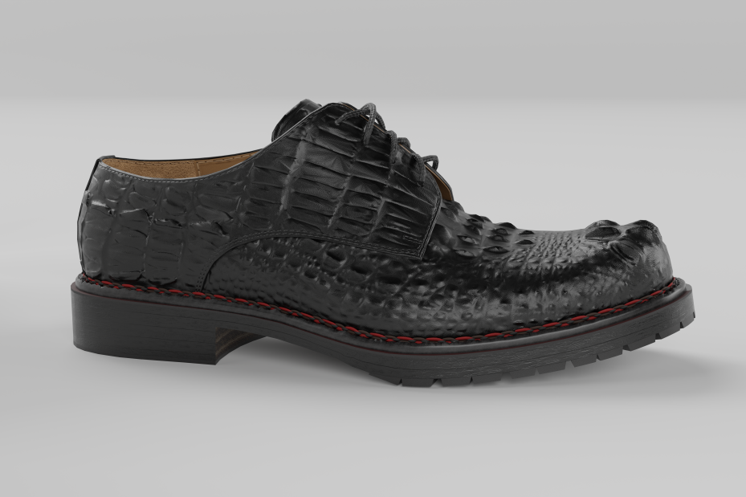

# 3d model viewer using r3f

This is 3D model viewer using react three fiber


https://github.com/user-attachments/assets/0897156a-fa89-499d-b42d-30910cb1c754


implement texture images

## Install
Copy the scene.gltf to public folder

```Start development server
npm run dev
